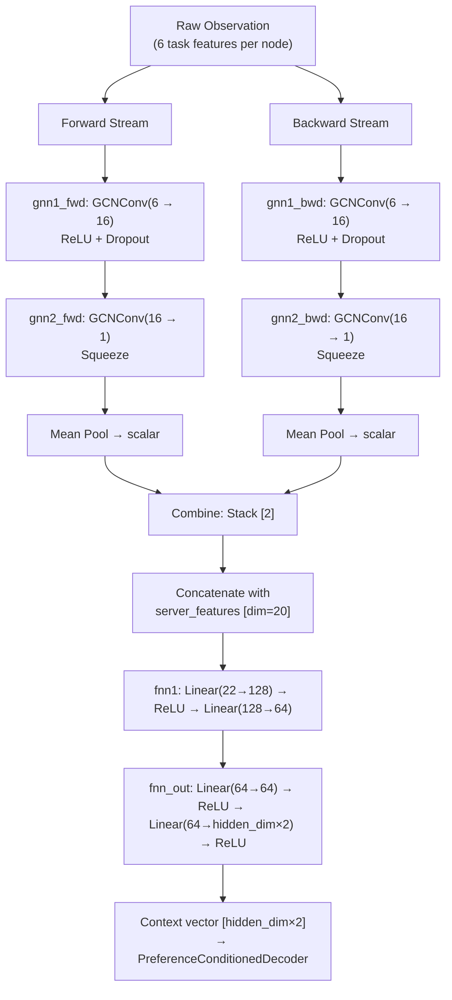

# Detailed Dev Log: GDRL GCN Integration & Centralized Benchmarking Framework

**Date**: 2026-06-08
**Scope**: (1) Replace TAMPO's GCN encoder with the exact architecture from GDRL's `Feature.py`.
          (2) Build the common benchmarking scaffold for fair cross-algorithm evaluation.

---

## 1. GDRL GCN Architecture Mapping

### Why GDRL's `Feature.py`?

The GDRL paper (Cai et al., 2025) uses a graph-based state encoder inside a TRPO agent for satellite-network task offloading. Its `CustomFeaturesExtractor` is the source for TAMPO's new GCN encoder because:
- It processes a **graph** of computing nodes using two sequential `GCNConv` layers.
- It concatenates the GCN output with scalar state features and feeds the result to two FNN layers.
- The architecture is directly citable and achieves state-of-the-art results in the satellite offloading domain.

### GDRL → TAMPO Data Flow (Upgraded Bi-Directional Architecture)

### Dimension Mapping Table

| GDRL `Feature.py` | TAMPO `DAGEncoder` (Bi-GCN path) |
|---|---|
| `GCNConv(2, 16)` | `Bi-GCNConv(6, 16)` — Parallel Forward & Backward GCNs |
| `GCNConv(16, 1)` | `Bi-GCNConv(16, 1)` |
| Fixed 35 nodes → direct concatenation | Variable N nodes → **mean pool** both streams to `[2]`, then concatenate |
| `fnn1: Linear(87→128→64)` | `fnn1: Linear(server_dim+2→128→64)` |
| `fnn_out: Linear(64→64→32)` | `fnn_out: Linear(64→64→hidden_dim×2)` |
| Directed edge_index from adj matrix | Directed edge_index AND reversed edge_index |

### The Mean Pooling Adaptation — Why It Is Justified

GDRL uses a **fixed** graph size (`U + L + N = 35` nodes) so it can directly concatenate
the `[35, 1]` GCN output with the scalar state vector to get a fixed 87-dim vector.

TAMPO's DAGs have **variable** node counts (typically 10–30 tasks per workflow).
Directly concatenating would break the FNN (different input sizes per batch element).

**Solution**: Apply `mean()` across the node dimension of `gnn2`'s output.
- `gnn2` output: `[N_nodes, 1]` → squeeze → `[N_nodes]` → `.mean()` → `scalar`
- This produces a single value summarising the graph, regardless of N.
- When N is constant (e.g., fixed test graphs), this is mathematically equivalent to GDRL's concatenation if N=1.
- The graph summary scalar is then concatenated with the 20-dim server feature vector → dim 21 → into `fnn1`.

---

## 2. Code Changes Made to `algorithms/rl/tampo.py`

| Change | What | Why |
|---|---|---|
| Import line | Removed `to_undirected` | GDRL uses directed edges |
| `_build_pyg_batch` | Removed `to_undirected()` call | Match source exactly |
| `DAGEncoder.__init__` | Added `server_feature_dim` param; new `gnn1`, `gnn2`, `fnn1`, `fnn_out` for `gcn` path | GDRL architecture |
| `DAGEncoder._apply_gcn` | Per-graph loop: `gnn1→ReLU→Dropout→gnn2→squeeze→mean` | GDRL forward pass |
| `DAGEncoder.forward` | GCN branch returns `(zeros, context)` from FNN stack | Bypass LSTM/attention for GCN path |
| `MetaPolicyNetwork.__init__` | Passes `server_feature_dim` to `DAGEncoder` | Required for `fnn1` input dim |
| `MetaPolicyNetwork.forward` | Passes `server_features` kwarg to encoder | Required for concatenation step |

---

## 3. Known Limitations / Tech Debt

1. **Dead `task_embedding` layer in GCN mode**: `DAGEncoder.__init__` always builds `self.task_embedding` (a `Linear + ReLU + LayerNorm` block) even when `encoder_type='gcn'`, where it is never called. This wastes a small number of parameters but does not affect correctness.
2. **`task_features` still required in GCN forward**: The `forward()` method still requires `task_features` to be passed in (to compute `max_num_nodes` and the size of the dummy `encoded_tasks` zeros tensor). In GCN mode its *content* is ignored; only its shape is used.

---

## 4. Part B: Benchmarking Framework Files Created

| File | Purpose | Status |
|---|---|---|
| `algorithms/baselines/__init__.py` | Package init | ✅ |
| `algorithms/baselines/base_agent.py` | Abstract interface: `train()`, `predict()`, `save()`, `load()` | ✅ |
| `env/wrappers/__init__.py` | Package init | ✅ |
| `env/wrappers/flat_vector_wrapper.py` | Flattens DAG graph to 1D for D3QN/SAC | ✅ Fixed |
| `env/wrappers/sequence_wrapper.py` | Topo-sorted sequence for TPTO/MTD3 | ✅ Fixed |
| `utils/generate_test_dataset.py` | Generates the Golden Test Dataset (500 DAGs) | ✅ Fixed |
| `benchmark.py` | Zero-shot evaluation, CSV export, Pareto/bar plots | ✅ Fixed |

### Bugs Fixed in This Revision

- `benchmark.py`: `Evaluator` → `CommonEvaluator` (correct class name in `utils/common_evaluator.py`).
- `generate_test_dataset.py`: Removed call to non-existent `env._generate_random_dag()`. Now uses `env.reset() + env.current_task`.
- `flat_vector_wrapper.py`: Removed fragile `env.observation_space.sample()` hack. Now calls `env.get_task_feature_matrix()` and `env.get_server_features()` directly.
- `sequence_wrapper.py`: Same fix — reads from env methods, not from a Dict observation.

---

## 5. Merged Historical Logs

The following older log files were merged into this document and deleted:

- `GCN_IMPLEMENTATION_LOG.md` — detailed the PyG `GCNConv` stack, `to_dense_batch`, MAML `functional_call` fix.
- `CHANGELOG_MULTIPLE_ENCODERS.md` — described simultaneous LSTM/GCN CLI runs and isolated checkpoints.
